# September 24, 2026: Keyboard Case Optimization

After a thorough examination, including checking the error and accuracy of my measurements, I realized that the case was too tight for the components. Because of this, I had to add a deep cutout for the MCU so it could fit properly and have some space for airflow.

However, this cutout affected the overall look and aesthetics of the case. As a last resort, I decided to add rubber pads for support—although in reality, they’re just made of PLA : / 

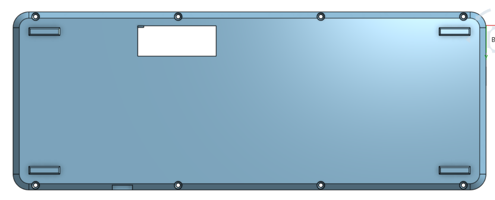

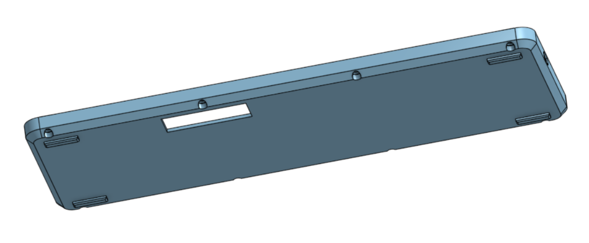

**Total time spent: 3 hours**

# September 22, 2026: Improvising the Case

 Yea this was loooooonnnnnnnnnggggggg and ttuffff!!!!

## Phase I
 As I recently modified the pcb with the added 4pin UART extension and some routing changes and the type c breakout board, I made a revisied version of the   Case. Once done I added final touch ups like Fillet and Chamber giving it a finished look.

## Phase II
 This was probably the most stupidist and most time pass part of my project,  Drawing the Keyboard Plate . Since I wanted this to be more of a Product based and not some random prototype, I spent hours trying to perfect the plate. And ended up deleting that and using default plate generator and modifying it. 
*Could have saved an hours work : /

I modified the plate by adjusting its lenght and width according to the case and added a Fillet. Also added screw holes for securing it tightly to the case!

## Phase III
Gave it a final touch up and bit of basic rendering !

## Result

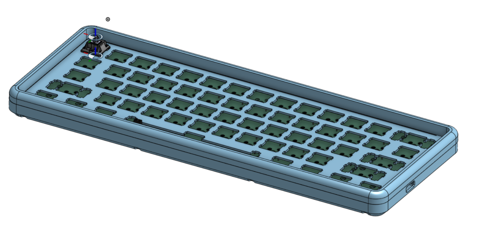

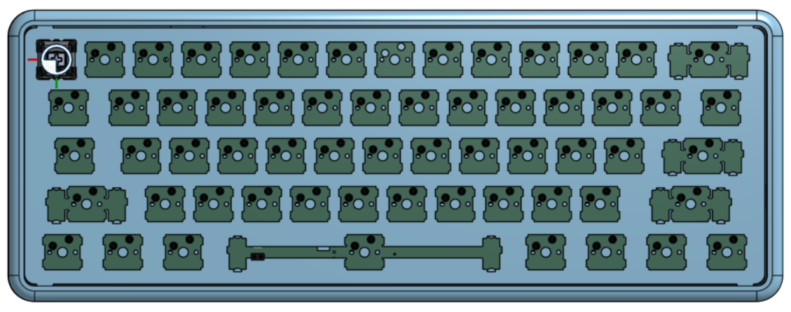

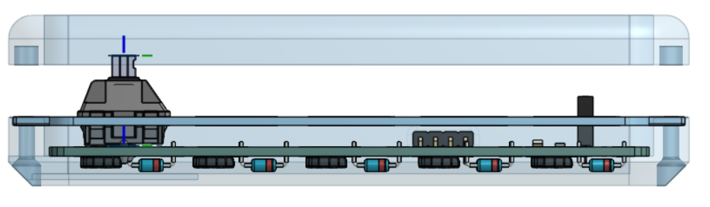

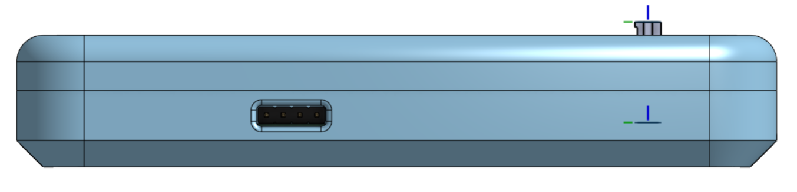

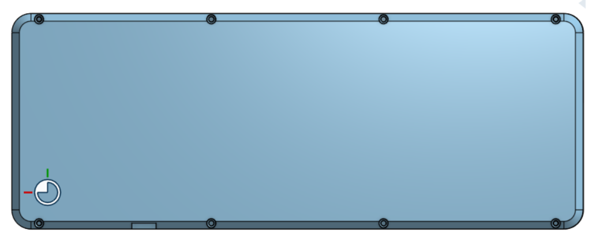

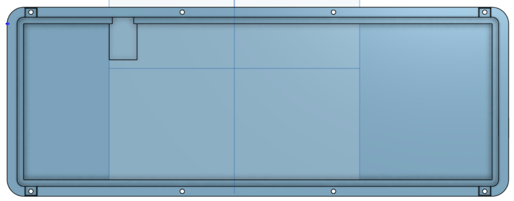

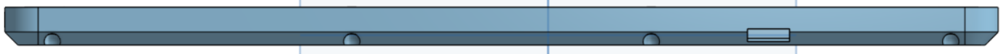

**Total time spent: 4 hours**

# September 20, 2026: Improvising the PCB

 So I spent the next 10-15ins on researching about the communications between two RP2040-zero's via UART, and if it could be used has an extension port ?

### Why ?
 Well cuz, I decided on building a small cute wired/wireless macropad which could be directly connected to this keyboard, so that i don't need a bunch of cables or a dongle to connect various accessories &lt;3: 

### MODs

- Do to the recent modifications, that's a 4pin (5v, D+, D-, GND) (UART), I can now connect another keeb or macropad or anything else via this UART extension without the need of an extra port or dongle.

- I also added a extrude for the USB C breakout board with slightly leaning towards the left of the keyboard. 

- Also due to constraint of avaliable GPIO pins, i resorted to using the GPIO 0 &amp; 1 for UART and shifted the ROW 1 &amp; 2 to the unsoldered GPIO pin which can be accessed on the back of the PCB.

### Result

**Total time spent: 2 hours**

# September 18, 2026: CADDING: Bottom Case

# Designing the Case

Designing the case was probably the **most challenging and brainstorming-heavy** part of building this keyboard. It wasn’t my first time working on something like this, but it still took a lot of thinking.
***
I spent about **half an hour researching DIY custom keyboard cases** to understand how different designs work. One thing I quickly noticed was how **expensive many custom keyboard cases are**, which made me even more motivated to design my own.

Eventually, I settled on the style I wanted: **minimalistic, clean, and professional**. I added a few **fillets and curved edges** to make the case look softer and more aesthetic instead of just a plain rectangular box.

I started by designing the **bottom case** first. One important thing I considered was clearance for the electronics. I left around **2 mm of space under the PCB** to accommodate the **through-hole solder joints** from the switches, along with a thin layer of **foam** between the PCB and the case for cushioning and sound dampening.
***

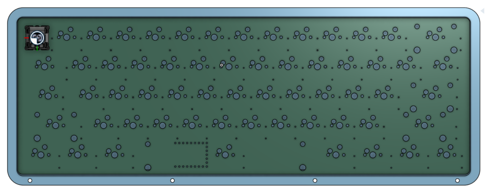

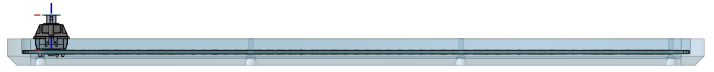

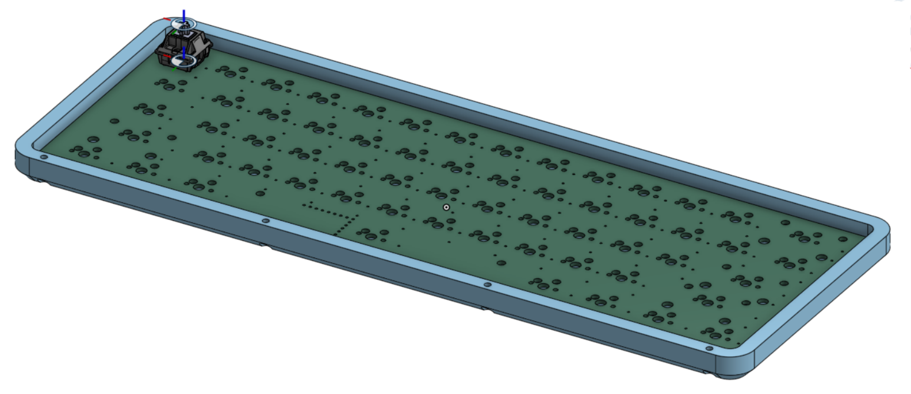

Software:  Onshape
***
Happy Cadding !!!

**Total time spent: 4 hours**

# September 15, 2026: PCB Designing

# PCB Design

After finishing the schematic, I moved on to designing the PCB in **KiCad**. This part was a bit more challenging because I wanted the keyboard to stay compact while still looking *clean* and *ergonomic*.

The first step was placing all the *Cherry MX switch* footprints in the proper **60% layout**. Once the switches were aligned, I started thinking about the overall board shape. Instead of keeping the edges completely straight, I experimented with slightly curved outlines to give the PCB a more cute and soft aesthetic rather than a rigid rectangular look.

One of the trickier parts was figuring out where to place the MCU. Since I’m using the *RP2040-Zero*, its small size actually helped a lot. After trying a few different placements, I realized it could fit nicely in the empty space to the left of the 6.25u spacebar. That spot had just enough room for the board while keeping the layout clean and avoiding interference with switches and stabilizers.

Keeping everything compact without making the routing messy took some trial and error. I had to carefully arrange the diodes and traces so the matrix stayed organized while still fitting within the board’s shape.

Once the main components were placed, I began routing the traces for the matrix and connecting everything back to the MCU. After routing, I ran a few DRC checks in KiCad again to make sure there were no clearance or connectivity issues.

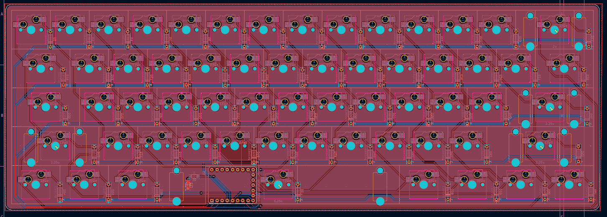

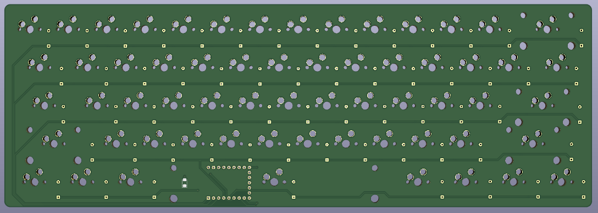

**Total time spent: 3.5 hours**

# September 12, 2026: Sketched the Schematic

# Schematic

After doing some research and installing the footprints for the Cherry MX switches and the RP2040-Zero, I started working on the schematic for the 60% mechanical keyboard.

It took me about an hour to sketch out the full schematic. I connected all the switches in a matrix and added the required diodes for proper key scanning. After the main circuit was done, I organized everything to make the schematic easier to read by grouping components into sections like the Matrix grid, MCU, stabilized keys, and the status LEDs.

Once everything looked good, I reviewed the schematic to check for mistakes. I also ran a few DRC (Design Rule Checks) in KiCad and fixed the small issues that popped up. After that, the schematic was clean and ready for the PCB layout stage.

***
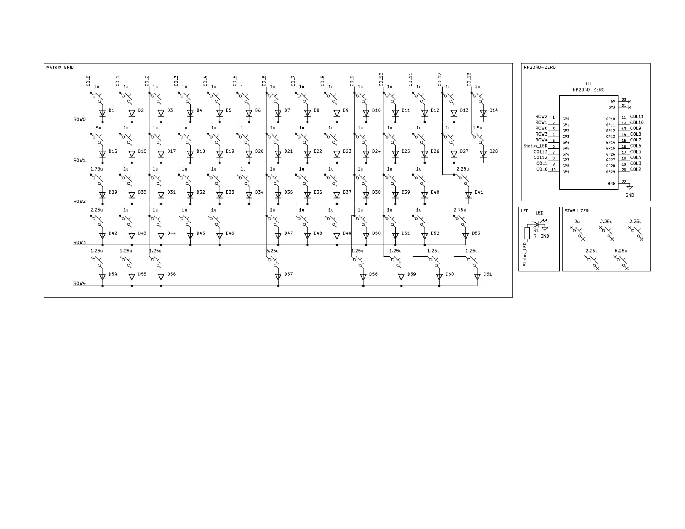
***
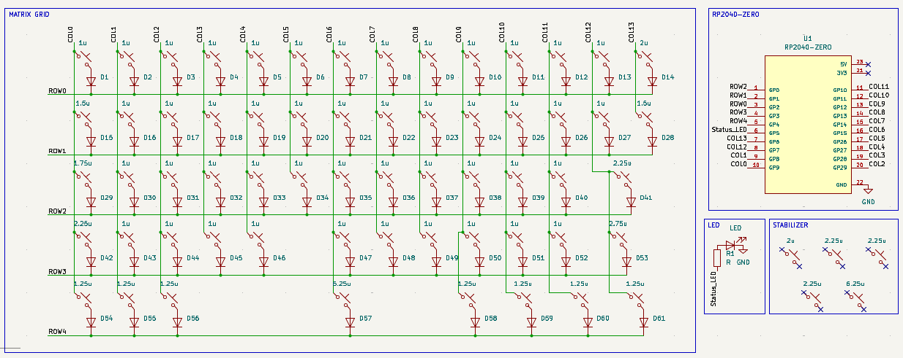
***

**Total time spent: 1.8 hours**

# September 7, 2026: Planning the layout

# Magnum60

**Magnum60** is a compact 60% mechanical keyboard designed to minimize desk space while keeping a clean and minimal aesthetic.
***

## Timeline

I spent around 25 minutes thinking about the keyboard layout because I wanted it to be **lightweight**, **portable**, and **efficient** in terms of usability.

For the next 20 minutes, I looked at different keyboards available in the market to find a design that had a *clean outer look*, *compact form factor*, and *good overall layout*.

After finalizing the layout and the outer case design, I drew a rough sketch of the keyboard matrix.

Based on the number of GPIO pins required, I started looking at different MCUs — from Arduinos to Raspberry Pi boards to Waveshare modules — and eventually decided to go with the ***RP2040-Zero***.

***

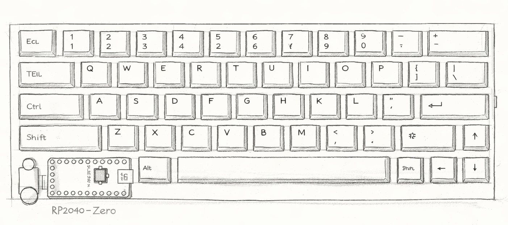

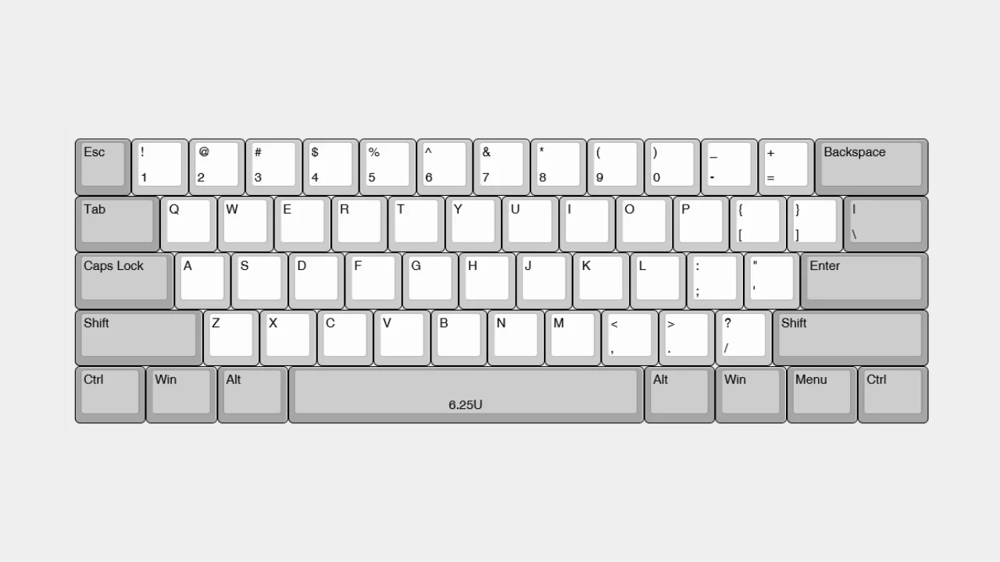

60% Mechanical Keyboard ANSI layout

**Total time spent: 2.7 hours**

