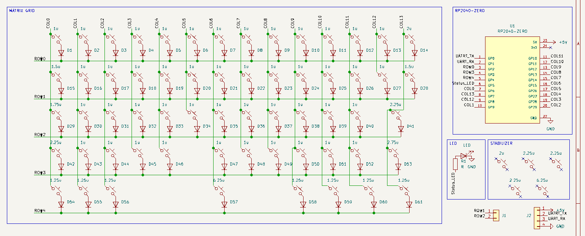
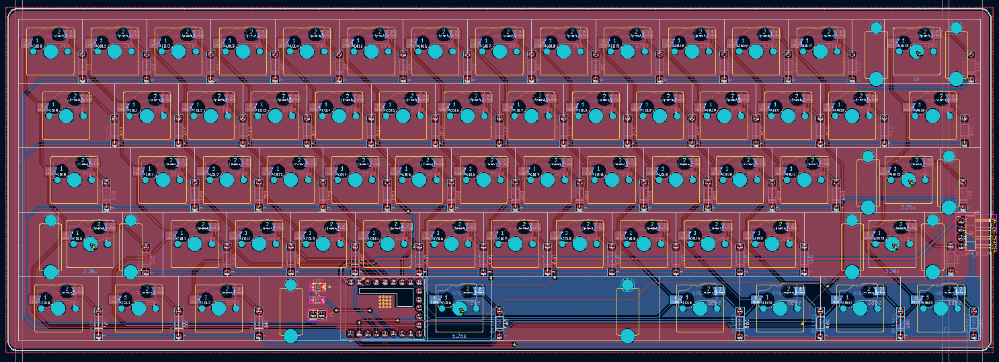

# Magnum60
Magnum60 is my custom 60% mechanical keyboard project built around an RP2040-ZERO controller.

I wanted a keyboard that felt clean and simple like a classic 60%, but still let me fully understand how the electronics actually work (matrix, diodes, routing, and firmware pin mapping), not just buy a kit and screw it together.

## Why I made this

I use my keyboard for school every day, so I wanted to build one that is actually mine from scratch.

Main goals I set for myself:
- Design a full 60% PCB in KiCad (61 keys)
- Use hot-swap MX footprints so it is easy to test switches
- Keep the design manufacturable and not just a concept render
- Learn the full pipeline: schematic -> PCB -> 3D model -> production files

## Project status

This repo includes the complete hardware design files and manufacturing outputs:
- KiCad project, schematic, and PCB
- 3D CAD export (.step)
- Plate DXF
- Production files (BOM, positions, designators, netlist)
- Custom RP2040-ZERO symbol/footprint library files

Current hardware summary:
- Layout: 60% ANSI style, 61 keys
- Controller: RP2040-ZERO
- Matrix: diode matrix (1 diode per switch)
- Stabilizers: 2u, 2.25u, 2.75u, 6.25u support

## Images

### Wiring / schematic screenshot

### Other Screenshots

## CAD

OnShape: [link](https://cad.onshape.com/documents/b52a919955139e6a718853bb/w/34cf3e6613baa59e9155a7be/e/0783ed61a417fa509f3e5ed3?renderMode=0&uiState=6ab6580c4abf9f8bfd310694)

## Firmware note

A KMK starter firmware is included in this repo:

- `firmware/kmk/main.py`
- `firmware/kmk/README.md`

It includes the row/column pin mapping from the current netlist and a base ANSI-like 61-key layout.

## BOM (summary)

Current BOM is in `bom.csv`.

| Name | Purpose | Quantity | Total Cost (USD) | Distributor | Link |
|---|---|---:|---:|---|---|
| 3D printed Case | 3D printing | 1 | 8.19 | Hack Club | https://printlegion.hackclub.com |
| PCB fabrication | PCB | 1 | 39.20 | Robu.in | https://robu.in/product/online-pcb-manufacturing-service/ |
| RP2040-zero | Microcontroller | 1 | 6.05 | Robu.in | https://robu.in/product/waveshare-rp2040-zero-raspberry-pi-mcu-with-presoldered-header/ |
| Cherry PBT Keycaps | Keycaps | 1 | 17.47 | Curiosity Caps | https://curiositycaps.in/products/counter-strike-printstream-decal-collectio-n-cherry-pbt-keycaps |
| Durock Smokey Screw-In Stabilizers V2 | Stabilizers | 1 | 17.00 | StacksKB | https://stackskb.com/store/durock-smokey-screw-in-stabilizers-v2/ |
| Akko V5 Creamy Blue Pro Switch (Pack of 45) | For typing I guess ? | 1 | 13.14 | StacksKB | https://stackskb.com/store/akko-v5-creamy-blue-pro-switch-pack-of-45/ |

**Total BOM cost:** 101.05 USD

